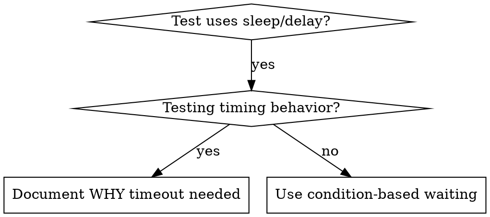

# Condition-Based Waiting — 条件等待

## 概述

Flaky 测试经常靠猜测时间来处理时序——用任意延迟。这在空闲机器上能跑过，但在负载下或 CI 中就会失败，制造竞态条件。

**核心原则**：等待你真正关心的条件，而不是猜测它需要多久。

## 何时使用



**使用场景：**
- 测试有任意延迟（`sleep`、`usleep`、`time.sleep()`、`Thread.sleep()`）
- 测试不稳定（有时过，负载下失败）
- 并行运行时测试超时
- 等待异步操作完成（刷盘、复制、选举、IO 完成）

**不使用：**
- 测试真实时序行为（心跳间隔、选举超时、debounce 间隔）
- 如果使用任意超时，必须注释说明 WHY

## 核心模式

```
❌ 之前：猜测时间
sleep(50ms)  // 希望操作完成
assert(result == expected)

✅ 之后：等待条件
WAIT_FOR(result == expected, timeout=5000ms)  // 最多等 5s
assert(result == expected)
```

## 快速模式

| 场景 | 模式 |
|------|------|
| 等待状态 | `WAIT_FOR(state == TARGET_STATE, timeout)` |
| 等待计数 | `WAIT_FOR(counter >= expected_count, timeout)` |
| 等待文件 | `WAIT_FOR(file_exists(path), timeout)` |
| 等待副本同步 | `WAIT_FOR(replica_index >= leader_index, timeout)` |
| 复杂条件 | `WAIT_FOR(condition_A && condition_B, timeout)` |

## 实现契约

Agent 应根据**当前测试文件**的语言和测试框架，自动生成条件等待的惯用实现（而非 `domain-config.yaml` 的主语言——基础设施项目常多语言混用）。以下为各语言的推荐模式：

| 语言 | 推荐实现 | 说明 |
|------|---------|------|
| C (cmocka) | 宏 `WAIT_FOR(cond, timeout_ms)`，内部用 `clock_gettime` + `usleep` 轮询 | 注意内存屏障：用 `__atomic_load_n` 读取共享变量 |
| C++ (gtest) | `ASSERT_TRUE(WaitForCondition([&]{return cond;}, timeout))` | 用 `std::atomic` 确保可见性 |
| Rust | `tokio::time::timeout(duration, poll_fn).await` 或 `spin_loop` | 类型系统保证线程安全 |
| Go | `assert.Eventually(t, func() bool { return cond }, timeout, interval)` | 内置支持 |
| Python (pytest) | `pytest.wait_for(cond, timeout=5.0)` 或自定义轮询 | 注意 GIL |

**实现要求（所有语言）：**
1. 轮询间隔 10ms（不要 1ms 浪费 CPU，不要 100ms 太粗糙）
2. 超时时打印清晰错误信息：等待了什么条件、实际状态是什么
3. 循环内读取共享状态（不要循环外缓存）
4. 多线程场景确保内存可见性（原子操作或内存屏障）

## 常见错误

**❌ 轮询太快：** 每 1ms 轮询 — 浪费 CPU，在 CI 环境中加剧负载
**✅ 修复：** 每 10ms 轮询，基础设施操作通常需要毫秒到秒级

**❌ 没有超时：** 条件永远达不到时死循环
**✅ 修复：** 总是包含带清晰错误信息的超时，打印实际状态帮助诊断

**❌ 数据陈旧：** 循环前缓存状态
**✅ 修复：** 在循环内重新读取共享变量

**❌ 内存可见性：** 轮询线程看不到写入线程的更新
**✅ 修复：** 使用语言对应的原子操作或同步原语确保可见性

## 何时任意超时是正确的

```
1. 先等待触发条件
   WAIT_FOR(state == CANDIDATE, timeout)

2. 然后基于已知时序等待
   sleep(election_timeout)  // 注释说明 WHY：等待 1 个选举周期

3. 验证时序行为
   assert(state == CANDIDATE)  // 未被选举说明超时正常触发
```

**要求：**
1. 先等待触发条件
2. 基于已知时序（不是猜测）
3. 注释说明 WHY

## 真实影响

来自分布式存储系统调试会话：
- 修复了 12 个 flaky 测试（WAL 刷盘、副本同步、领导者选举）
- 通过率：60% → 100%
- 执行时间：快 35%（不再等待最坏情况的固定延迟）
- 不再有竞态条件
