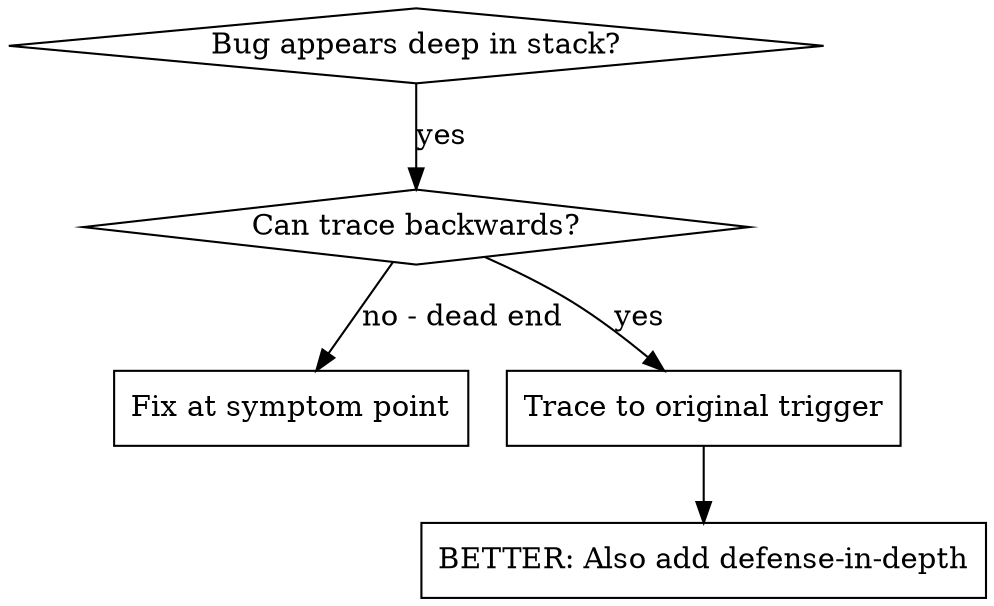
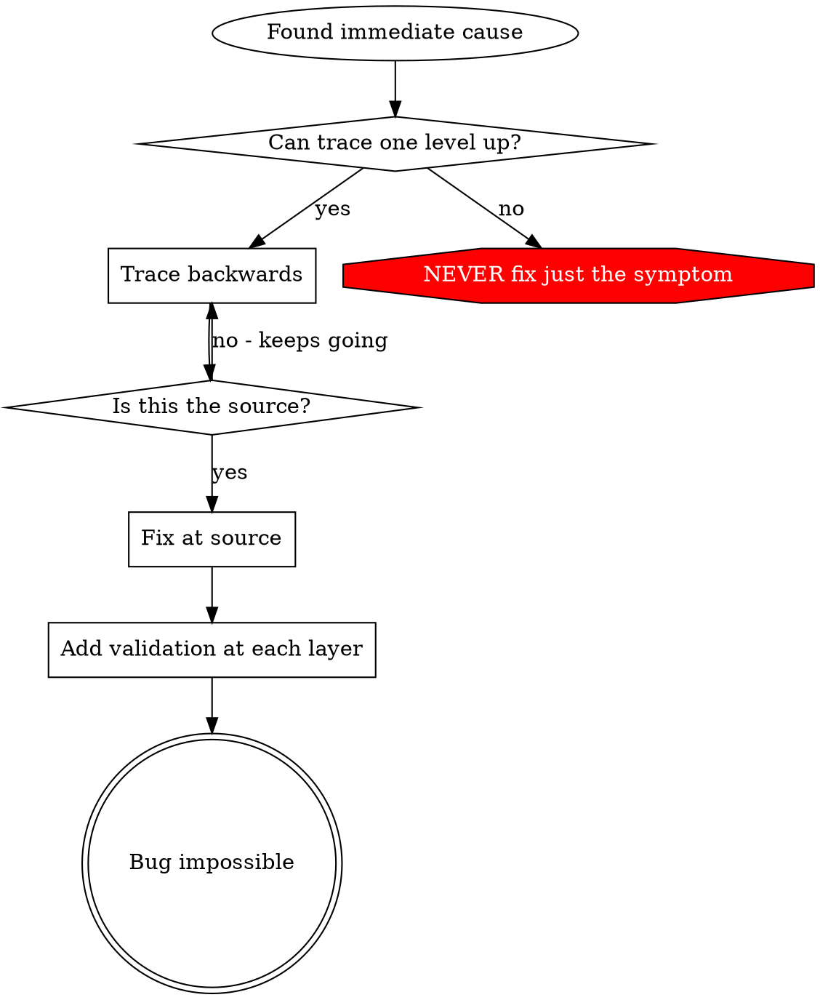

# Root Cause Tracing — 根因追溯

## 概述

Bug 经常表现在调用栈深处（WAL 写入了错误的段文件、副本同步到了错误的节点、读请求返回了过期数据）。你的本能是在报错位置修复，但那只处理了症状。

**核心原则**：沿着调用链反向追溯，找到原始触发点，在源头修复。

## 何时使用



- 错误发生在执行深处（不在入口点）
- Stack trace 显示长调用链
- 不清楚无效数据从哪里产生
- 多组件交互中，错误在下游暴露但根因在上游

## 追溯流程

### 1. 观察症状
```
Error: WAL segment 00042 write failed — EIO at offset 32768
```

### 2. 找到直接原因
**什么代码直接导致了这个问题？**
```c
rc = pwrite(wal_fd, buf, len, offset);
if (rc < 0) {
    log_error("WAL segment %05u write failed — %s at offset %lu",
              seg->seq, strerror(errno), offset);
    return -EIO;
}
```

### 3. 追问：谁调用了这个？
```
wal_append_record(wal, record)
  ← wal_commit_entry(wal, entry)
  ← coord_apply_write(coord, request)
  ← coord_handle_client_rpc(coord, conn, msg)
  ← raft_apply_entry(raft, entry)    ← Raft 一致性协议层提交
```

### 4. 继续向上追溯
**传了什么值？**
- `offset = 32768` — 恰好是当前段的起始位置
- 但 `seg->seq = 42` 段文件不存在！
- 段切换逻辑认为旧段已满，但新段尚未创建
- 时序：旧段刷盘完成 → 切换到新段 → 但 `wal_open_segment()` 在 `pwrite` 之前失败了，错误码被静默丢弃

### 5. 找到原始触发点
**段切换为何在刷盘未完成时就触发了？**
```c
/* 根因：刷盘完成回调唤醒了等待者，但段切换条件用了 >= 而非 == */
if (wal->pending_flushes >= 0) {  /* 应为 == 0：等待所有刷盘完成 */
    wal_rotate_segment(wal);      /* 在刷盘进行中就切换了段！ */
}
```

## 添加诊断日志

当无法手动追溯时，在关键路径注入诊断：

```c
/* 在问题操作之前捕获完整上下文 */
static int wal_append_record(wal_t *wal, const wal_record_t *rec)
{
    log_debug("WAL append: seg=%05u offset=%lu len=%zu pending_flushes=%d "
              "state=%d caller=%p",
              wal->active_seg->seq, wal->write_offset, rec->data_len,
              wal->pending_flushes, wal->state,
              __builtin_return_address(0));

    int rc = pwrite(wal->fd, rec->data, rec->data_len, wal->write_offset);
    /* ... */
}
```

**关键**：在操作前打日志，不是在失败后。失败后的日志缺少触发条件的状态快照。

**运行并捕获：**
```bash
# 提高日志级别运行单测
WAL_LOG_LEVEL=DEBUG ./run-tests.sh ut:test_wal_rotate

# 或在集成测试中过滤特定段序列号
./run-tests.sh it:test_cluster_write 2>&1 | grep 'seg=00042'
```

**分析诊断日志：**
- 检查 `pending_flushes` 值——切换时不应该 > 0
- 检查 `state` 字段——段状态机是否按预期转换
- 检查 `caller` 地址——用 `addr2line` 反查调用来源

## 真实案例：段切换竞态

**症状**：WAL 段 00042 写入 EIO，段文件不存在

**追溯链：**
1. `pwrite(fd, ...)` 在不存在的段文件上写入 ← 段切换后 fd 无效
2. `wal_rotate_segment()` 在刷盘进行中被调用 ← 条件判断错误
3. 刷盘完成回调使用了 `>= 0` 而非 `== 0` ← 原始 bug
4. 多线程并发写入放大了竞态窗口 ← 条件变量唤醒了多个等待者

**根因**：条件判断使用 `>=` 而非 `==`，导致在还有 pending flush 时就触发段切换

**修复**：将 `wal->pending_flushes >= 0` 改为 `wal->pending_flushes == 0`

**同时添加 defense-in-depth：**
- Layer 1: `wal_rotate_segment()` 前断言 `pending_flushes == 0`
- Layer 2: `wal_append_record()` 验证 fd 有效性，否则拒绝写入
- Layer 3: 段切换时加写屏障，确保新段创建可见后再唤醒写入者
- Layer 4: 段状态机日志，记录每次状态转换和触发条件

## 核心原则



**绝不只修复报错位置。** 反向追溯找到原始触发点。

## 诊断日志技巧

**操作前**：在危险操作之前打日志，不是在失败之后——失败后缺少触发条件的状态快照
**包含上下文**：段序列号、偏移量、状态机状态、待完成操作计数、调用者地址
**捕获调用链**：`__builtin_return_address(0)` + `addr2line` 或 `backtrace()` + `backtrace_symbols()`
**多线程场景**：日志必须包含线程 ID 和锁持有状态，否则无法还原时序
**注意**：热路径诊断日志必须在非调试构建中可编译关闭（`#ifdef WAL_DEBUG`）

## 真实影响

来自分布式存储系统调试会话：
- 通过 5 层追溯找到根因（pwrite → 段切换 → 条件判断 → 竞态窗口）
- 在源头修复（`== 0` 而非 `>= 0`）
- 添加 4 层防御（断言、fd 验证、写屏障、状态机日志）
- 零回归，段切换竞态彻底消除
