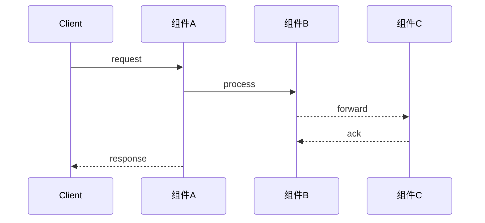
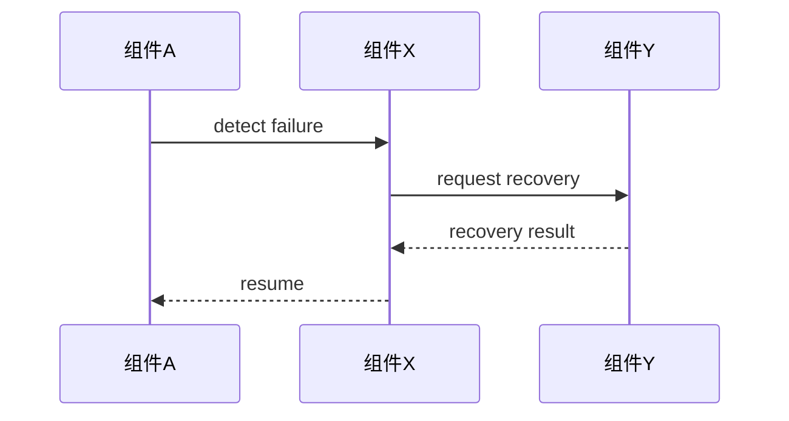

## Context

<!-- 背景、现状、约束、利益相关方 -->

<!-- 以下为占位符示例，实际生成时替换为具体内容 -->

[背景描述：这个设计处于什么上下文中，为什么要做它]。

[现状描述：当前系统的相关状态，与本设计相关的既有实现或约定]。

[约束描述：架构约束、性能约束、兼容性约束、资源约束等]。

[非功能约束：引用 `spec.md` 中「Non-Functional Requirements」章节的性能、可靠性、兼容性、可观测性、升级兼容性要求，并说明本设计如何满足或为何豁免]。

[利益相关方：谁会受到这个设计的影响，他们的关注点是什么]。

## Goals / Non-Goals

**Goals:**
<!-- 本设计要达成什么 -->

<!-- 以下为占位符示例，实际生成时替换为具体内容 -->

- [目标描述]
- [目标描述]
- [目标描述]

**Non-Goals:**
<!-- 明确排除什么 -->

<!-- 以下为占位符示例，实际生成时替换为具体内容 -->

- [明确排除的范围]
- [明确排除的范围]

## Solution Overview

<!-- 在了解 Context 和 Goals 之后，读者需要看到"我们打算怎么做"。类比论文摘要。篇幅：3-5 段 -->
<!-- 不要在这里论证"为什么选方案 X"——那是 Decisions 的事。这里只回答： -->
<!-- - 整体方案是什么（一句话概括） -->
<!-- - 核心思路是什么（为什么选择这个方向） -->
<!-- - 关键组件有哪些（读者读完能画出大致架构） -->
<!-- - 最终交付什么（这个 design 落地后，系统行为有什么变化） -->

<!-- 以下为占位符示例，实际生成时替换为具体内容 -->

本方案旨在解决 [核心问题]。整体思路是 [一句话概括设计哲学]，通过 [关键手段] 达成 [目标]。

设计分为 [N] 个层次：
- **[层/阶段名称]**：[一句话职责]。它与 [其他层] 的关系是 [...]。
- **[层/阶段名称]**：[一句话职责]。

关键组件包括 [组件A]、[组件B]、[组件C]。它们之间的协作方式是 [...]，数据流向为 [...]。

方案的限制条件和适用范围：[明确说明本方案适用于什么场景、在什么约束下可能不适用]。

## Architecture

<!-- 在"方案总览"之后，读者自然需要建立"空间感"——有哪些组件、怎么组织、数据怎么流动 -->
<!-- 1 个架构图 + 2-3 段组件说明 -->
<!-- 如果产品级架构已定义，引用即可，说明本特性涉及的部分 -->

### Component Architecture

<!-- 特性级设计的架构图：只画"与本特性相关的子系统"和"子系统内涉及的模块" -->
<!-- 不要画整个系统大图。没有涉及的模块不用出现，或用灰色/虚线弱化 -->
<!-- 存储领域习惯上下分层：Client / 控制面在上，数据面 / 持久化层在下 -->

<!-- 以下为占位符示例，实际生成时替换为具体内容 -->

```
        Client
          │
          ▼
   ┌─────────────┐
   │   Gateway   │        ◄── 相关子系统
   │  ┌───────┐  │
   │  │Router │  │        ◄── 本特性涉及模块
   │  └───┬───┘  │
   └──────┼──────┘
          │
          ▼
   ┌─────────────┐
   │ Storage Node│        ◄── 相关子系统
   │  ┌───────┐  │
   │  │Log Mgr│  │        ◄── 本特性涉及模块
   │  └───┬───┘  │
   │  ┌───┴───┐  │
   │  │Engine │  │        ◄── 相关但本次不改动的模块（可弱化）
   │  └───────┘  │
   └─────────────┘
```

<!-- 绘图约定： -->
<!-- - 上下分层：请求从上方进入，逐层下沉到存储/持久化层 -->
<!-- - 子系统用外框包裹，内部模块独立成框 -->
<!-- - 只出现"本特性涉及"或"需要说明边界"的模块，其他省略 -->
<!-- - 双向箭头表示推拉/回调；虚线表示配置、元数据或弱依赖 -->
<!-- - 在图旁用文字标注：哪些是新增/修改模块，哪些是只读依赖 -->

### Component Description

<!-- 2-3 段：说明各层/组件的职责、边界、数据流向 -->
<!-- 避免"组件 A 负责 X，组件 B 负责 Y"这种列表式写法 -->
<!-- 而是叙述："当请求到达时，首先由 A 处理 [...]，随后交给 B 进行 [...]" -->

<!-- 以下为占位符示例，实际生成时替换为具体内容 -->

**[组件 A]** 是整个方案的入口点。它的核心职责是 [...]。当 [...] 时，它会 [...]，然后将 [...] 传递给 [组件 B]。

**[组件 B]** 负责 [...]。它与 [组件 A] 之间的契约是 [...]。在处理过程中，如果 [...]，它会 [...]。

**[组件 C]** 作为 [角色，如"持久化层"/"协调者"] 存在。它的关键设计约束是 [...]，因为 [...]。

## Key Flows

<!-- 了解组件组成后，读者想知道"这些组件怎么协作完成一个请求/任务？" -->
<!-- 选择 1-3 个最关键的流程，用时序图展示 -->
<!-- 避免"每个组件画一个时序图"的过度工程 -->

### [流程名称，如"写入请求处理流程"]

<!-- 1 段：这个流程的触发条件、业务意义、涉及哪些组件 -->

<!-- 以下为占位符示例，实际生成时替换为具体内容 -->

当 [用户/系统] 发起 [操作] 时，[组件A] 收到请求后，依次协调 [组件B]、[组件C] 完成 [...]。这个流程是本方案中最关键的路径，因为它 [...]。



<!-- 1-2 段：说明流程中的关键决策点、异常分支、性能考量 -->

<!-- 以下为占位符示例，实际生成时替换为具体内容 -->

流程中的关键决策点在于 [...]。如果 [条件]，流程会走 [...] 分支，否则走 [...] 分支。

性能方面，[某个步骤] 是潜在的瓶颈，因为 [...]。缓解措施是 [...]。

### [流程名称，如"异常恢复流程"]（如适用）

<!-- 同上一结构。选择最能体现方案特色的流程 -->

<!-- 以下为占位符示例，实际生成时替换为具体内容 -->

当 [用户/系统] 发起 [操作/事件] 时，[组件X] 检测到 [异常条件] 后，触发 [恢复动作]。这个流程体现了本方案在 [某类故障] 场景下的行为。



流程中的关键恢复决策是 [...]。如果 [恢复失败]，系统会 [...]。

## Decisions

<!-- 关键技术选择及理由 -->
<!-- 以叙述段为主，对比表辅助，避免"只有结论没有思路"的写法 -->
<!-- 每个 Decision 按以下结构填充： -->

<!-- ### Decision N: <决策主题> -->

<!-- **[1 段] 问题**：我们面临什么选择？为什么这个选择不是显而易见的？ -->

<!-- **[2-3 段] 候选方案分析**： -->
<!-- 不要只列方案名称，要用一段话说清楚每个方案的核心思想和适用条件。 -->
<!-- 例如："方案 A（来自 research.md 维度 X）的核心思路是 [...]。它在 [...] 场景下表现优异，典型实现如 [产品名]。但在我们的约束下（[约束条件]），它面临 [...] 问题。" -->
<!-- 每个候选方案标注标杆来源（research.md 中已研究的方案）。 -->

<!-- **[可选] 对比表**：当方案差异复杂时，用表格辅助理解。表格是叙述的补充，不是替代。 -->
<!-- | 维度 | 方案 A | 方案 B | -->
<!-- |------|--------|--------| -->
<!-- | 复杂度 | ... | ... | -->
<!-- | 性能影响 | ... | ... | -->
<!-- | 可维护性 | ... | ... | -->
<!-- | 与本项目约束的匹配度 | ... | ... | -->

<!-- **[1 段] 结论**：选择方案 X 因为 Y。不选 A 是因为 ...，不选 B 是因为 ... -->

<!-- **[1 段] 取舍代价**：... -->
<!-- **[1 段] 缓解措施**：... -->
<!-- **[1 段] 演进性**：... 或「本决策无演进性需求」 -->

<!-- 合法回退：每项允许「显式标注本项不适用」作为合法填法 -->
<!-- 已被产品级架构约束确定的决策：直接引用架构文档，无需列备选 -->
<!-- 涉及并发或多节点交互时：在对应决策下声明并发模型（锁类型、粒度、顺序、happens-before） -->
<!-- 涉及多状态组件时：在对应决策下提供状态转换表（| 当前状态 | 事件 | 下一状态 | 动作 |） -->

<!-- 强制出图条件： -->
<!-- - 跨进程/跨节点交互 → 时序图（Mermaid sequenceDiagram） -->
<!-- - 有生命周期的对象（租约、连接、会话）→ 状态机图（Mermaid stateDiagram） -->
<!-- - 数据缓存、读写路径分离 → 数据流图（Mermaid flowchart） -->

<!-- 以下为占位符示例，实际生成时替换为具体内容 -->

### Decision 1: [决策主题，如"一致性模型选择"]

**问题**：我们面临什么选择？为什么这个选择不是显而易见的？

[1 段描述问题背景。]

**候选方案分析**：

方案 A（来自 research.md [维度]）：[核心思路]。它在 [场景] 下表现优异，典型实现如 [产品名]。但在我们的约束下（[约束]），它面临 [问题]。

方案 B（来自 research.md [维度]）：[核心思路]。它在 [场景] 下表现优异，典型实现如 [产品名]。但在我们的约束下（[约束]），它面临 [问题]。

**结论**：选择方案 X 因为 Y。不选 A 是因为 [...]，不选 B 是因为 [...]。

**取舍代价**：[选择带来的代价]。

**缓解措施**：[如何缓解该代价]。

**演进性**：[未来扩展方向] 或「本决策无演进性需求」。

## Interface Changes

<!-- 如涉及跨子系统接口，列出变更的接口定义及影响 -->
<!-- 格式： -->
<!-- ### 接口: <接口名称> -->
<!-- - 变更类型：新增 / 修改 / 废弃 -->
<!-- - 函数签名 / 数据结构 / 协议格式：... -->
<!-- - 兼容性：向前兼容 / 向后兼容 / 破坏性变更 -->

<!-- 以下为占位符示例，实际生成时替换为具体内容 -->

### 接口: [接口名称]
- 变更类型：[新增 / 修改 / 废弃]
- 函数签名 / 数据结构 / 协议格式：`[签名]` / `[结构体]` / `[协议格式]`
- 兼容性：[向前兼容 / 向后兼容 / 破坏性变更]
- 影响范围：[哪些子系统或模块会调用/实现该接口]

## Risks / Trade-offs

<!-- 格式：[风险] → [缓解措施] -->
<!-- 每个 Risk 必须有对应的 Mitigation，不能只列风险不给方案 -->

<!-- 以下为占位符示例，实际生成时替换为具体内容 -->

- **[风险 1]**：[具体描述风险，如"新引入的锁粒度较粗，可能成为并发瓶颈"] → [缓解措施，如"后续通过 per-partition 锁拆分优化，本期先保证正确性"]
- **[风险 2]**：[具体描述风险] → [缓解措施]

## Upgrade Compatibility Statement

<!-- 本章节不是特性级部署流程，而是评估本特性对系统升级流程的影响。 -->
<!-- 分布式存储的版本升级由系统级升级模块统一负责；特性级设计只需声明：是否引入升级风险、升级模块需要做什么、回滚是否安全。 -->
<!-- 必须对应 `spec.md` 中「Upgrade Compatibility」的要求。 -->

<!-- 以下为占位符示例，实际生成时替换为具体内容 -->

**升级风险判定**：[无风险 / 低风险 / 高风险]

**对系统升级流程的要求**：
- 是否需要升级模块介入：[是 / 否]
- 如涉及持久化元数据变更：[变更点、版本号、是否需要迁移/双写/读旧格式；注意：元数据迁移由升级模块/元数据服务统一实现，不在特性级解决]
- 如涉及协议/RPC/数据格式变更：[兼容策略、多版本协商要求、是否需要特性层提供兼容解析]
- 如涉及配置格式变更：[旧配置如何映射到新配置、是否需要自动转换]
- 是否需要特性级辅助机制：[feature flag / 双写 / 影子读 / 版本协商 / 无]

**回滚安全性**：[升级失败回滚时，本特性是否会留下不一致状态 / 是否安全 / 是否需要数据清理]

**依赖项**：[本特性生效前，系统必须升级到的最低版本]

## Open Questions

<!-- 待解决的决策或未知项 -->

<!-- 以下为占位符示例，实际生成时替换为具体内容 -->

- **[问题 1]**：[待解决的设计决策或未知项，如"极端场景下重试次数上限是否需要可配置？"] → [当前状态，如"待 owner 确认，预计下次评审前关闭"]
- **[问题 2]**：[待解决的未知项] → [当前状态]
