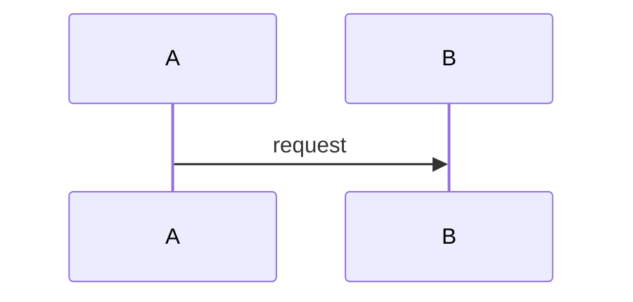

## Context

<!-- 背景、现状、约束、利益相关方。约束中引用 spec.md 的非功能需求，并说明本设计如何满足或为何豁免。 -->

## Goals / Non-Goals

**Goals:**
<!-- 本设计要达成的 2-5 个具体目标 -->

**Non-Goals:**
<!-- 明确排除的范围 -->

## Solution Overview

<!-- 3-5 段：整体方案一句话概括、核心思路、关键组件、最终交付的系统行为变化。不要论证"为什么选方案 X"。 -->

## Architecture

<!-- 只画与本特性相关的子系统/模块。存储领域习惯上下分层：Client / 控制面在上，数据面 / 持久化在下。 -->

### Component Architecture

<!-- ASCII Art 或 Mermaid 图。新增/修改模块明确标注；被本特性读取但本次不改动的依赖模块可弱化。 -->

### Component Description

<!-- 2-3 段叙述各组件职责、边界、数据流向。 -->

## Key Flows

<!-- 1-3 个最关键流程，用时序图展示。说明触发条件、关键决策点、异常分支、性能考量。 -->

### [流程名称]

<!-- 触发条件、业务意义、涉及组件 -->

<!-- 关键决策点、异常分支、性能考量 -->

## Decisions

<!-- 每项决策：问题、候选方案分析、结论。候选方案分析需包含各方案优缺点；结论说明最终选择及相应取舍代价。已被架构约束确定的直接引用。涉及并发/多节点/多状态时声明模型。 -->

### Decision 1: [决策主题]

**问题**：

**候选方案分析**：

**结论**：

## Interface Changes

<!-- 如涉及跨子系统接口：先在此用 1 段说明整体影响范围，再逐条接口列变更类型、定义。系统级兼容性问题在 ## Upgrade Impact 中统一说明。 -->

整体影响范围：

### 接口: [接口名称]

- 变更类型：[新增 / 修改 / 废弃]
- 函数签名 / 数据结构 / 协议格式

## Risks / Trade-offs

<!-- 每个风险必须有缓解措施。格式：[风险] → [缓解措施] -->

- **[风险 1]**：[具体描述] → [缓解措施]

## Upgrade Impact

<!-- 说明本设计对系统升级流程的具体影响（how），对应 spec.md 中 Upgrade Compatibility NFR 的量化目标（what）。无影响时可写「本期不涉及」。 -->

- 升级风险判定：[无风险 / 低风险 / 高风险]
- 对升级流程的要求：是否需要升级模块介入、元数据/协议/配置变更、兼容策略、回滚安全性

## Open Questions

<!-- 待解决的决策或未知项 -->

- **[问题 1]**：[描述] → [当前状态]
