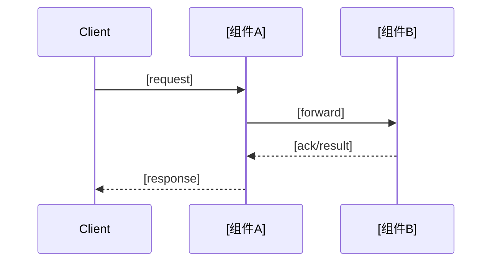

# Research

<!-- 特性级研究文档：标杆方案分析 + 关键决策维度对比 -->
<!-- 作为 design 阶段的输入。提供素材而非决策——选哪个方案、怎么实现，由 design 阶段负责 -->

<!-- 篇幅参考（按特性复杂度自动调整）：
     简单特性（单一算法/优化）：200-350 行
     中等特性（缓存机制/调度策略）：350-600 行
     复杂特性（分布式一致性/共识协议）：600-900 行
-->

## 1. 背景与目标

<!-- 30-50 行：让评审者快速理解本研究要解决什么问题、为什么选这些标杆 -->

**问题与目标**：

<!-- 1-2 段：从 proposal.md 提炼 -->
<!-- - 本特性要解决的核心问题 -->
<!-- - 关键 Capabilities 与性能目标 -->
<!-- - 设计上需要重点权衡的方面 -->

**标杆选择**：

<!-- 说明为什么选这 N 个标杆（2-3 个），强调互补性而非穷举 -->
<!-- - 标杆 A：[产品名] —— 代表 [某种范式/路线]，[选择理由] -->
<!-- - 标杆 B：[产品名] —— 代表 [某种范式/路线]，[选择理由] -->
<!-- - （可选）标杆 C：[产品名] —— 代表 [某种范式/路线]，[选择理由] -->

## 2. 标杆方案分析

<!-- 按产品组织，每个标杆 150-200 行，保持方案的整体性 -->
<!-- 不要把单一标杆拆散到多个章节，让评审者能完整理解一个方案的设计哲学 -->

### 2.1 [产品名]

**方案全景**：

<!-- 1-2 段：用一段话说清楚该标杆的整体设计思路（如"NFSv4 = timeout 弱一致兜底 + delegation 可选升级 + COMPOUND 摊销"） -->

**整体架构**：

<!-- 必须画 1 个模块层级图（纵向分层），10-20 行 -->
<!-- 展示客户端内部模块组织、协议边界、与服务端的接口 -->
<!-- 不是横向交互时序图，而是纵向分层结构 -->
<!-- 绘图约定：上下分层（请求从上进入，逐层下沉），子系统外框包裹内部模块，旁注标注模块角色 -->

```
        Client
          │
          ▼
   ┌─────────────┐
   │ [Sub-system]│        ◄── 子系统层级说明
   │  ┌───────┐  │
   │  │ModuleA│  │        ◄── 本特性涉及模块
   │  └───┬───┘  │
   └──────┼──────┘
          │
          ▼
   ┌─────────────┐
   │ [Sub-system]│        ◄── 子系统层级说明
   │  ┌───────┐  │
   │  │ModuleB│  │        ◄── 本特性涉及模块
   │  └───┬───┘  │
   │  ┌───┴───┐  │
   │  │ModuleC│  │        ◄── 相关但本次不改动的模块（可弱化）
   │  └───────┘  │
   └─────────────┘
```

**核心机制**：

<!-- 2-3 个核心机制，每个三层拆解（原理 / 设计 / 取舍） -->
<!-- 仅在最关键的 1 个机制下额外画时序图（可选，不是每个都画） -->

#### 机制 1：[名称]

- **原理**：<!-- 核心思想，解决什么问题 -->
- **设计**：<!-- 关键数据结构 / 控制流（不贴源码，最多引用类名/字段名） -->
- **取舍**：<!-- 量化 trade-off：性能数字 + 适用场景 + 不适用场景 -->

#### 机制 2：[名称]

- **原理**：...
- **设计**：...
- **取舍**：...

<!-- 仅在最体现该标杆特色的机制下加时序图（可选）-->
<!-- 时序图 10-20 行，展示客户端-服务端的关键交互流程 -->

**交互流程**（仅最核心机制配此图）：



#### 机制 3：[名称]（如适用）

- **原理**：...
- **设计**：...
- **取舍**：...

**适用场景与已知坑点**：

<!-- 1-2 段，浓缩 -->
<!-- - 适用场景：什么工作负载选这个方案 -->
<!-- - 1-2 个最关键的坑点（来源：源码 / 论文 / 生产实践） -->

### 2.2 [产品名]

<!-- 同 2.1 结构 -->

### 2.3 [产品名]（如有第 3 个标杆）

<!-- 同 2.1 结构 -->

## 3. 关键决策维度对比

<!-- 提炼 3-5 个核心决策维度，按维度做横向对比 -->
<!-- 约束嵌入对比分析，不单独列约束清单 -->

### 3.1 [维度 1 名称，如「一致性机制」]

**标杆对比**：

| 标杆 | 方案 | Trade-off | 适用场景 |
|------|------|----------|---------|
| [产品 A] | [方案描述] | [量化 trade-off] | [适用条件] |
| [产品 B] | [方案描述] | [量化 trade-off] | [适用条件] |
| [产品 C] | [方案描述] | [量化 trade-off] | [适用条件] |

**约束影响分析**：

<!-- 把约束直接嵌入到该维度的选择分析中，不要单独列约束清单 -->
<!-- 说明：哪些约束影响这个维度的选择？已知约束如何收窄选项？未知约束需主人确认什么？ -->

- **已知约束**：
  - [约束内容]（来源：proposal.md#章节 或 docs/...#章节）→ 影响：[如何影响该维度的方案选择]
- **已确认约束**（主人在生成期确认的）：
  - [约束内容] = [具体取值] → 影响：[...]
- **条件分支**（主人暂时不确定的约束）：
  - 如果 [约束 X] = [取值 A] → [方案选择倾向]
  - 如果 [约束 X] = [取值 B] → [方案选择倾向]

<!-- 可选：复杂依赖时画决策树 -->

### 3.2 [维度 2 名称]

<!-- 同 3.1 结构 -->

### 3.3 [维度 3 名称]

<!-- 同 3.1 结构 -->

## 引用与追溯

<!-- 列出本研究引用的所有外部资料 -->
<!-- - 标杆 [产品 A]：论文链接 / 源码位置 / 官方文档 -->
<!-- - 标杆 [产品 B]：... -->
<!-- - 产品级文档锚点（如有）：docs/.../#章节 -->
