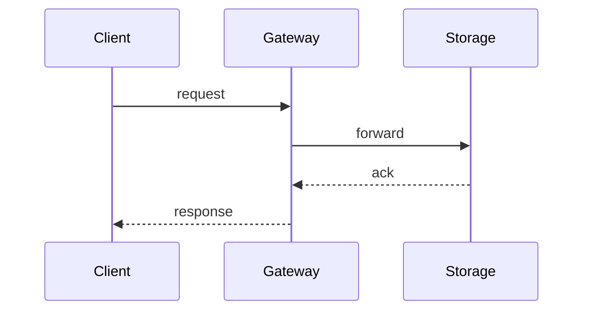
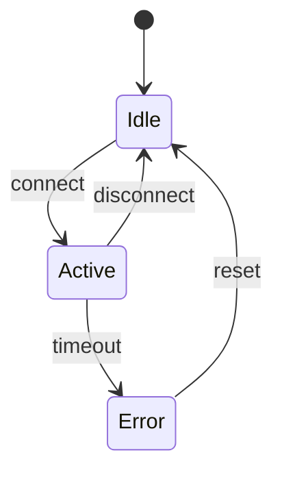
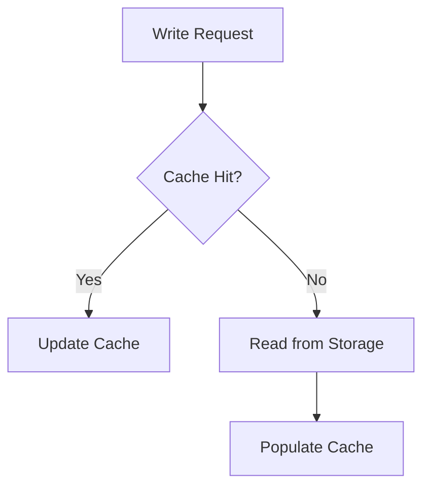

# devforge-feature-design — 特性级架构设计

## 概述

特性级架构设计是 specs + research 之后的实现方案阶段。本 skill 产出 design.md，说明如何（HOW）实现 specs 中定义的需求。

> **内容规范强牵引**：design 交付件的所有内容结构、章节要求、自检清单**以 `openspec-schema/schemas/spec-driven-enhanced/templates/design.md` 为唯一准绳**。本 skill 只负责定义**努力程度、写作风格、质量门槛和流程控制**，不再重复模板中已有的内容要求。

**与产品级 design 的区别**：
- 产品级（`/df:product-design`）：子系统分解 + ADR + 系统架构总纲，产出 `docs/architecture/*.md`
- 特性级（本 skill）：在既有架构内展开，不新建子系统，产出 change-dir 的 `design.md`

**核心原则**：
1. **在既有架构内展开**：不新建子系统，不改变系统级架构决策
2. **强制图示**：结构图（ASCII Art）、时序图（Mermaid）、状态机图（Mermaid）、数据流图（ASCII Art 或 Mermaid），按触发条件强制出图
3. **Decision 追溯标杆**：每个 Decision 的候选方案标注 research.md 中的标杆来源
4. **skill 内化评审**：最多 3 轮 architect agent → architect-reviewer 循环

---

## 工作目录约定

skill 在 **change-dir**（默认当前工作目录）查找输入文件、输出产出文件：
- **change-dir**：由 `--change-dir <path>` 参数指定，无参数时默认当前工作目录
- **输入**：`proposal.md`（必需）、`research.md`（必需）、`specs/*.md`（如已存在）
- **输出**：`design.md`
- **内容模板**：`openspec-schema/schemas/spec-driven-enhanced/templates/design.md`（plugin 内置模板，章节结构与内容要求的唯一准绳）
- **产品级文档**：通过项目根目录的 CLAUDE.md#产品级文档索引定位

**调用方式**：
- **手动调用**：用户先 `cd` 到包含 `proposal.md` 的目录，然后调用 `/df:design`；或显式传入 `--change-dir <path>`
- **workflow 调用**：由主会话传入 `--change-dir <path>`，以指定目录为工作上下文

## 启动检测

**change-dir**：由 `--change-dir <path>` 参数指定，无参数时默认当前工作目录。

检查 change-dir 的 `design.md`：
- **不存在** → 进入「初次生成」模式
- **已存在** → 反问主人「修订 / 补全」，按指定模式运行

如果 change-dir 无 `proposal.md` 或 `research.md`，立即报错并提示主人检查 `--change-dir` 参数、`cd` 到正确目录或先完成前置 artifact。

---

## 初次生成模式

### [1] 上下文准备

读取以下输入（路径均相对于 change-dir）：
1. **proposal.md**：本特性的动机和范围
2. **research.md**：约束清单 + 标杆方案空间 + 设计空间地图
3. **specs/*.md**（如已存在）：行为规范的详细定义
4. **产品级架构文档**（按需）：`docs/architecture/` 下相关子系统设计、ADR
5. **输出格式**：见下方「Agent 派遣 Prompt 模板」中的输出结构定义

### [2] Decision 生成

派遣 1 个 architect agent，任务：
- 读 research.md 的设计空间地图，识别关键决策点
- 对每个决策点，列出候选方案（标注 research.md 中的标杆来源）
- 用表格比较 trade-off（复杂度 / 性能影响 / 可维护性 / 与本项目约束的匹配度）
- 明确写出"选择 X 因为 Y"，不选其他候选的具体理由
- 产出：Decisions 章节（写入 `design-draft.md`）

### [3] 强制图示检查

主会话读 design-draft.md，检查是否满足强制出图条件：
- 模块结构、组件关系（≥3 个组件）→ 结构图（Markdown ASCII Art）
- 跨进程/跨节点交互 → 时序图（Mermaid `sequenceDiagram`）
- 有生命周期的对象（租约、连接、会话）→ 状态机图（Mermaid `stateDiagram`）
- 数据缓存、读写路径分离 → 数据流图（Markdown ASCII Art 或 Mermaid `flowchart`）

**图示生成方式**：

| 图示类型 | 格式 | 生成方式 |
|---------|------|---------|
| 结构图 | Markdown ASCII Art | 在 `design-draft.md` 中直接嵌入 ASCII 方框图 |
| 时序图 | Mermaid | 在 `design-draft.md` 中嵌入 `sequenceDiagram` 代码块 |
| 状态机图 | Mermaid | 在 `design-draft.md` 中嵌入 `stateDiagram` 代码块 |
| 数据流图 | Markdown ASCII Art 或 Mermaid | 按表达清晰度选择 |

未满足 → 派遣 architect agent 补充图示。

### [4] 其他章节生成

派遣 1 个 architect agent，任务：
- 读取 `openspec-schema/schemas/spec-driven-enhanced/templates/design.md`，按模板章节顺序补全 design.md 剩余章节
- 产出：完整 design.md（写入 `design-draft.md`）
- 注意：模板中已定义各章节的内容要求、自检清单和强制图示触发条件，无需在 prompt 中重复

### [5] 评审循环（最多 3 轮）

派遣 1 个 architect-reviewer agent，任务：
- 读 design-draft.md 全文
- 检查：方案可行性、方案竞争力、方案合理性、架构一致性、设计内部一致性、可维护性、故障处理、决策备选方案、并发模型、状态机表达、性能评估、**升级影响评估（按 `openspec-schema/schemas/spec-driven-enhanced/templates/design.md` 的 `## Upgrade Impact` 章节检查）**
- 产出：问题清单（CRITICAL / HIGH / MEDIUM / LOW）

计算缺陷密度（问题分数之和 / Decision 数）：
- 无 CRITICAL + 缺陷密度 ≤ 2.0 → 通过，进入 [6]
- 否则 → 派遣 1 个 architect agent 修正，回到本步骤重新评审
- 3 轮后仍未通过 → 标注残留问题，进入 [6]

### [6] 落地输出

将 `design-draft.md` 重命名为 `design.md`。在终端汇报：
- Decision 数
- 图示数（结构图 / 时序图 / 状态机图 / 数据流图）
- 置信度（评审通过 / 带债通过）

---

## 修订模式

反问主人「想修订哪一块」，提供选项：
1. 修订 Decisions（重新比较候选方案）
2. 修订图示（补充或调整 ASCII Art 或 Mermaid 代码块）
3. 修订其他章节（按 `openspec-schema/schemas/spec-driven-enhanced/templates/design.md` 的章节清单选择）

只跑对应范围的生成阶段，merge 结果回 design.md，不动其他章节。评审循环只检查变更范围。

图示修订时：
- 结构图/数据流图：在 design.md 中直接修改 ASCII Art
- 时序图/状态机图：在 design.md 中直接修改 Mermaid 代码块

---

## 补全模式

用结构性元素清单扫描 design.md，识别缺失项：
- 与 `openspec-schema/schemas/spec-driven-enhanced/templates/design.md` 章节结构对比，标记缺失章节
- Decision 缺失候选方案或 trade-off 分析
- 缺失强制图示（检查 design.md 中 ASCII Art 或 Mermaid 代码块）

补全图示时，直接在 design.md 缺失位置生成 ASCII Art 或 Mermaid 代码块，评审循环。

---

## Agent 派遣 Prompt 模板

### architect agent（Decision 生成）

```
当前是特性级 design 阶段，生成 design.md。

**任务模式**：特性级架构决策主角（既有架构内展开 Decisions）
**任务**：生成 Decisions 章节；其他章节按 `openspec-schema/schemas/spec-driven-enhanced/templates/design.md` 补全。

**输入**：
- proposal.md：change-dir
- research.md：change-dir（读设计空间地图，识别关键决策点）
- specs/*.md：change-dir（如已存在）
- 产品级架构文档：docs/architecture/<相关子系统>/design.md
- 内容模板：openspec-schema/schemas/spec-driven-enhanced/templates/design.md（必须严格遵循其章节结构与内容要求）

**template_path**：`openspec-schema/schemas/spec-driven-enhanced/templates/design.md`（写作前 MUST 先读取）
**output_path**：`design-draft.md`（change-dir）

**输出**：
每个 Decision：
- 候选方案（标注 research.md 中的标杆来源）
- 对比表格（复杂度 / 性能影响 / 可维护性 / 与本项目约束的匹配度）
- 结论（选择 X 因为 Y，不选 A 因为 ...，不选 B 因为 ...）
- 取舍代价 + 缓解措施
- 演进性（或"本决策无演进性需求"）

按 `openspec-schema/schemas/spec-driven-enhanced/templates/design.md` 的章节顺序补全其余章节（Context、Goals/Non-Goals、Solution Overview、Architecture、Key Flows、Interface Changes、Risks/Trade-offs、Upgrade Impact、Open Questions 等）。

写入 `design-draft.md`。

**质量约束**：
- 有选择空间的决策必须有 ≥2 个候选方案
- 量化优先（性能用具体数值，空间开销用具体公式）
- 涉及并发时声明并发模型（锁类型、粒度、获取顺序）
- 涉及多状态组件时提供状态转换表
```

### architect-reviewer agent

```
当前是特性级 design 阶段，评审 design-draft.md。

**被评审对象**：<路径>
**被评审 template 路径**：`openspec-schema/schemas/spec-driven-enhanced/templates/design.md`（评审锚点来源 1：章节结构、必填项、自检清单）
**review_output_path**：`design-review.md`（change-dir，多轮追加同一文件）
**report_template_path**：`templates/review-report.md`（如存在）
**复杂度档位**：复杂（≥7 个质疑点）

**评审维度**：
1. 模板符合性：是否严格遵循 `openspec-schema/schemas/spec-driven-enhanced/templates/design.md` 的章节结构、内容要求和强制图示触发条件
2. 通用质量：方案可行性、方案竞争力、方案合理性、架构一致性、设计内部一致性、可维护性、故障处理、决策备选方案、并发模型、状态机表达、性能评估、升级影响评估

**输出**：
问题清单（CRITICAL / HIGH / MEDIUM / LOW），计算缺陷密度。

**问题分级标准**：
- CRITICAL：方案不可行、违反架构原则、关键路径无故障处理
- HIGH：方案竞争力不足、决策不合理、缺少备选方案
- MEDIUM：可维护性问题、性能评估不充分
- LOW：文档格式、命名不一致

**问题分值**：CRITICAL=10分, HIGH=3分, MEDIUM=1分, LOW=0.1分  
**缺陷密度** = 问题分数之和 / Decision 数
```

---

## 禁忌项

- 禁止在 design.md 中新建子系统（特性级在既有架构内展开）
- 禁止跳过强制图示检查
- 禁止 Decision 只列一个方案没有备选（已被架构约束的除外）
- 禁止跳过评审循环直接输出

---

## 图示生成细则

### 结构图（Markdown ASCII Art）

用纯文本方框图表达组件分层和依赖关系：

```markdown
        Client
          │
          ▼
   ┌─────────────┐
   │   Gateway   │
   │  ┌───────┐  │
   │  │Router │  │
   │  └───┬───┘  │
   └──────┼──────┘
          │
          ▼
   ┌─────────────┐
   │ Storage Node│
   └─────────────┘
```

**绘图约定**：
- 上下分层：请求从上方进入，逐层下沉到存储/持久化层
- 子系统用外框包裹，内部模块独立成框
- 只出现"本特性涉及"或"需要说明边界"的模块，其他省略
- 双向箭头表示推拉/回调；虚线表示配置、元数据或弱依赖
- 在图旁用文字标注：哪些是新增/修改模块，哪些是只读依赖

### 时序图（Mermaid）

用 Mermaid `sequenceDiagram` 表达跨组件交互：

```markdown

```

**使用约束**：
- 仅在跨进程/跨节点/跨组件交互时使用
- 选择 1-3 个最关键的流程，避免过度工程
- 10-20 行，聚焦核心交互路径

### 状态机图（Mermaid）

用 Mermaid `stateDiagram` 表达有生命周期对象的状态转换：

```markdown

```

**使用约束**：
- 仅在对象有明确生命周期（租约、连接、会话）时使用
- 必须标注触发事件和转换条件

### 数据流图（按需选择格式）

简单数据流用 ASCII Art，复杂流向用 Mermaid `flowchart`：

```markdown

```

---

## 与其他 skill 的协作

- **上游**：proposal.md + research.md + specs/*.md（由主人创建）
- **下游**：tasks.md（由主人基于 design.md 生成任务清单）
- **并行**：无（design 是 tasks 的前置依赖）
